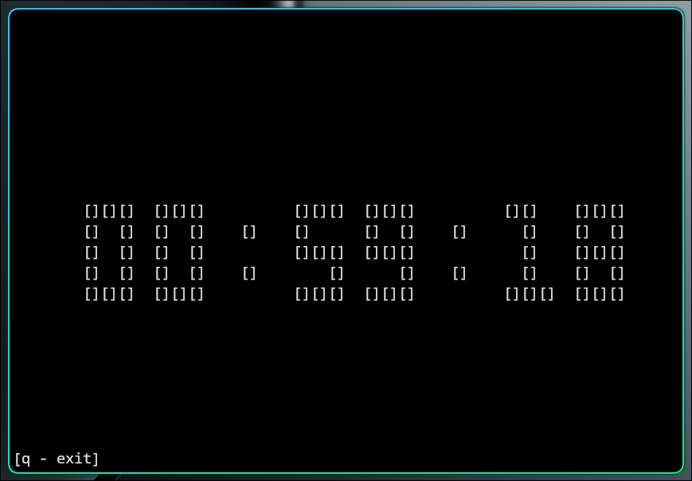

## CLI timer

### usege:
```bash
python timer.py [seconds]
```
also you can run it like this
```bash
./timer.py [seconds]
```

### example:
```bash
python timer.py 3600
```

### preview


! you need paplay for sound